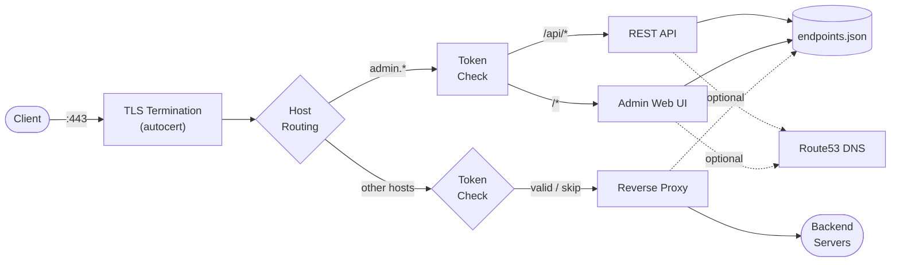

<p align="center">
  
</p>

<h1 align="center">gossl</h1>

<p align="center">
  A reverse proxy with automatic TLS certificate management via
  <a href="https://pkg.go.dev/golang.org/x/crypto/acme/autocert">acme/autocert</a>,
  token-based access control, and a built-in admin interface.
</p>

<p align="center">
  <a href="https://goreportcard.com/report/github.com/mlctrez/gossl"></a>
</p>

---

## Features

- Automatic TLS certificate provisioning and renewal (Let's Encrypt)
- Reverse proxy with per-host backend routing
- Token-based access control with per-host bypass option
- Web admin UI for managing endpoints at runtime
- REST API for programmatic endpoint management
- Optional Route53 DNS integration (automatic CNAME creation/removal)
- JSON-backed endpoint persistence (no restart required for changes)
- TLS 1.2 minimum with HTTP/2 support
- Suppresses noisy TLS handshake errors from non-SNI clients
- Runs as a system service via [servicego](https://github.com/mlctrez/servicego)

## Quick Start

### Build

```bash
make build
```

This produces a statically linked binary at `temp/gossl` (CGO disabled for portability).

### Deploy

The binary is managed as a system service through [servicego](https://github.com/mlctrez/servicego). The `-action` flag controls the service lifecycle:

| Action | Description |
|---|---|
| `deploy` | Copies the binary to `/opt/servicego/gossl/`, stops and uninstalls any previous version, then installs and starts the new one |
| `install` | Registers the service with the system service manager |
| `start` | Starts the service |
| `stop` | Stops the service |
| `uninstall` | Removes the service registration |
| `run` | Runs in the foreground (default) |

The `Makefile` includes a `deploy` target that builds, copies the binary to a remote host via SCP, and runs the deploy action over SSH:

```bash
make deploy HOST=myserver
```

For manual deployment, copy the built binary to the target host and run:

```bash
sudo /tmp/gossl -action deploy
```

Environment variables should be placed in `/etc/sysconfig/gossl` for the service to pick up at startup.

## Configuration

gossl is configured through environment variables. When running as a system service, place these in `/etc/sysconfig/gossl`.

### Required Variables

| Variable | Description |
|---|---|
| `ADDRESS` | Listen address in `host:port` format (e.g. `0.0.0.0:443`) |
| `ACME_DOMAIN` | Domain used for the authentication cookie scope |
| `GO_SSL_TOKEN` | Secret token for access control — use a long, random UUID |

### Optional: Route53 DNS Management

When configured, gossl automatically creates and removes CNAME records when endpoints are added or removed through the admin interface.

| Variable | Description |
|---|---|
| `AWS_ACCESS_KEY_ID` | AWS access key for Route53 |
| `AWS_SECRET_ACCESS_KEY` | AWS secret key for Route53 |
| `AWS_REGION` | AWS region (e.g. `us-east-1`) |
| `ROUTE53_HOSTED_ZONE_ID` | Route53 hosted zone ID |
| `ROUTE53_CNAME_TARGET` | Target for CNAME records (e.g. `proxy.example.com`) |

## Endpoint Management

Endpoints are stored in `endpoints.json` and can be managed three ways:

### 1. Admin Web UI

Navigate to `https://admin.<your-domain>/` and authenticate with your token. The web interface lets you add, edit, and remove endpoints with a form-based UI. DNS status is displayed when Route53 integration is enabled.

### 2. REST API

All API endpoints are served under the admin host at `/api/`.

**List endpoints**
```bash
curl -s https://admin.example.com/api/endpoints \
  -b "go-ssl-token=YOUR_TOKEN"
```

**Add an endpoint**
```bash
curl -s -X POST https://admin.example.com/api/endpoints \
  -b "go-ssl-token=YOUR_TOKEN" \
  -H "Content-Type: application/json" \
  -d '{"host":"app.example.com","url":"http://10.0.0.1:9000","skipToken":false}'
```

**Remove an endpoint**
```bash
curl -s -X DELETE https://admin.example.com/api/endpoints/app.example.com \
  -b "go-ssl-token=YOUR_TOKEN"
```

## Authentication

Access is controlled by a secret token set in `GO_SSL_TOKEN`. To authenticate:

1. Visit `https://<any-configured-host>/<your-token>` to set the cookie
2. The cookie is scoped to `ACME_DOMAIN` and valid for one year
3. Subsequent requests are validated via the `go-ssl-token` cookie

Individual endpoints can bypass token validation by enabling "Skip Token" in the admin UI or setting `"skipToken": true` via the API.

## Architecture



## License

See [LICENSE](LICENSE).

---

<sub>Created by <a href="https://github.com/mlctrez/tigwen">tigwen</a></sub>
